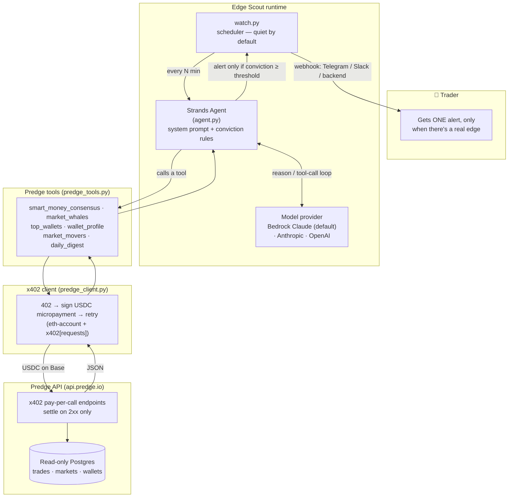

# Architecture

Edge Scout is a single Strands agent with six paid tools. The novel piece is the
**x402 payment layer inside the tool call**: the agent autonomously buys each
piece of data it needs, per call, in USDC.



## Decision flow

1. `watch.py` wakes the agent on an interval (or run `agent.py` once).
2. The agent anchors on `smart_money_consensus()`, then confirms a candidate
   with whale concentration + wallet track record, and checks the move hasn't
   already run.
3. It scores conviction 0–100. **Alert** only when flow is one-sided, the wallets
   genuinely win, and there's price left — otherwise **hold** (silent).
4. Alerts (and only alerts) are pushed to the human via the webhook.

## Why x402 matters here

Each tool call is a real purchase. The agent isn't handed a bulk data dump — it
decides what one question it needs answered and pays a few cents for exactly
that. Predge settles only on a successful (`2xx`) response, so failed calls are
free. This is the "agents pay for what they use" economy running end-to-end
inside a single tool invocation.

## Deploying to Amazon Bedrock AgentCore

The agent object is provider-agnostic, so hosting it on **Bedrock AgentCore
Runtime** is additive — wrap `build_agent()` with the AgentCore entrypoint and
deploy; the tool/payment layer is unchanged:

```python
# app.py (AgentCore Runtime entrypoint)
from bedrock_agentcore import BedrockAgentCoreApp
from agent import build_agent

app = BedrockAgentCoreApp()
scout = build_agent()

@app.entrypoint
def invoke(payload):
    return scout(payload.get("prompt", "Scan for an edge now."))

if __name__ == "__main__":
    app.run()
```

Local `agent.py` / `watch.py` and the AgentCore deployment share the exact same
agent and tools; only the host changes.
